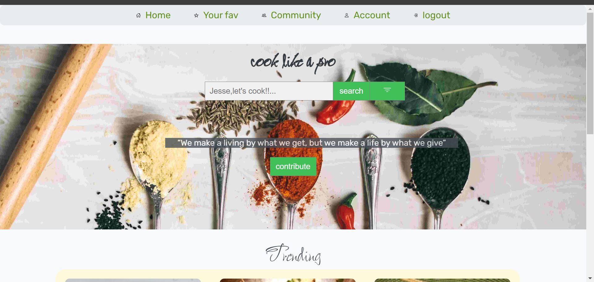
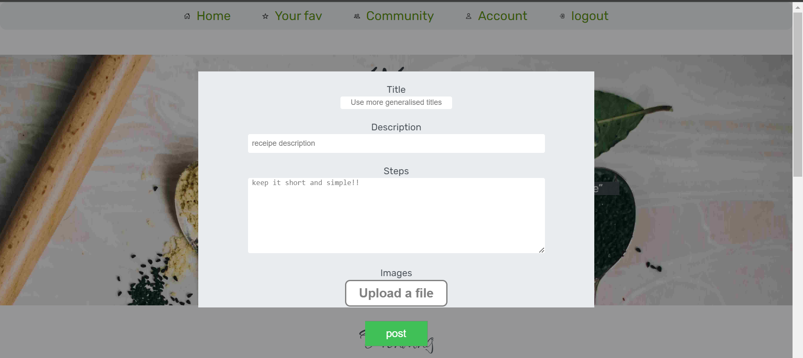
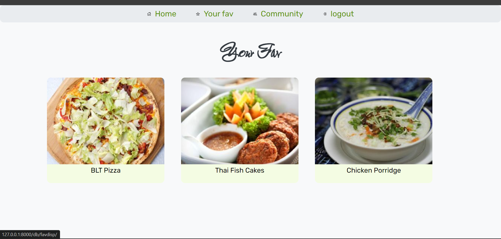
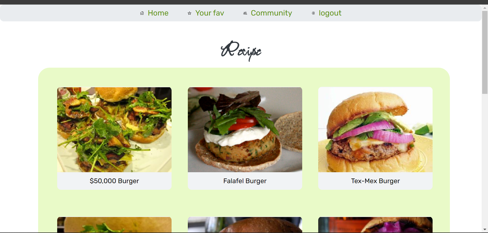
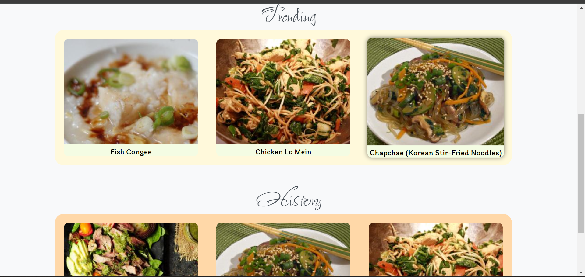
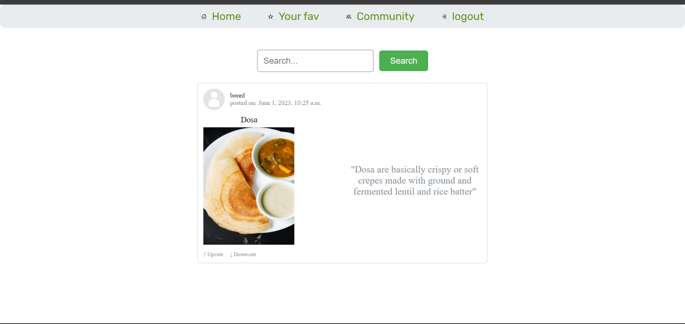

# Recipe Share

Welcome to Recipe Share, a platform designed for discovering and sharing recipes while fostering a community of food enthusiasts.

## Features

- **Search Functionality**: Easily search for recipes based on ingredients, cuisine types, or dietary preferences.
- **Recipe Sharing**: Share your favorite recipes with the community and receive feedback.
- **Community Interaction**: Connect with like-minded individuals, join cooking challenges, and exchange culinary ideas.
- **Rating and Comments**: Rate recipes and leave comments to help others decide what to cook.
- **Trending Recipes**: Stay updated with the latest trending recipes and popular culinary trends.
- **Search History**: Access your search history for quick reference and revisit past recipes.
- **Favorites**: Save your favorite recipes for quick access and reference.
- **Coin-based Mechanism**: Earn coins by sharing recipes, engaging with the community, and participating in challenges. Use coins to unlock additional search options or access premium features.

## Screenshots

### Home screen

### Upload page for Recipes

### Favourite

### Select form wide varites

### Trending-history

### Account page

### Community page

